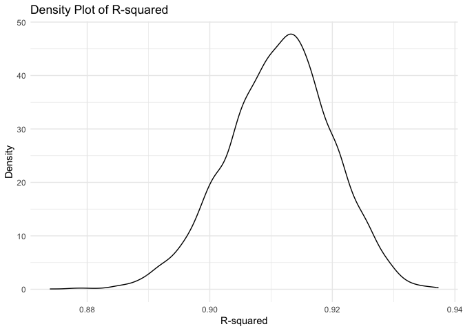
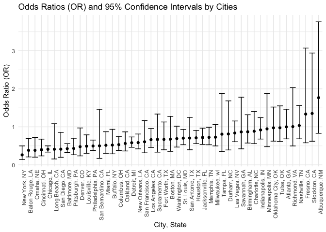

p8105_hw6_dl3757
================
Dang Lin dl3757
2024-12-02

``` r
# Import the libraries
library(tidyverse)
library(purrr)
library(broom)
library(modelr)
```

# Problem 1

``` r
# Load and clean the dataset
weather_df = 
  rnoaa::meteo_pull_monitors(
    c("USW00094728"),
    var = c("PRCP", "TMIN", "TMAX"), 
    date_min = "2017-01-01",
    date_max = "2017-12-31") %>%
  mutate(
    name = recode(id, USW00094728 = "CentralPark_NY"),
    tmin = tmin / 10,
    tmax = tmax / 10) %>%
  select(name, id, everything())
```

``` r
# Set seed for reproducibility
set.seed(1)

# Bootstrap
boot_straps <- 
  weather_df %>% 
  modelr::bootstrap(n = 5000) %>% 
  mutate(
    models = map(strap, \(df) lm(tmax ~ tmin, data = df)),
    results = map(models, broom::tidy), 
    r_squared = map(models, \(model) broom::glance(model) %>% pull(r.squared)),
    log_beta_product = map(models, \(model) {
      coefs <- broom::tidy(model)
      beta_0 <- coefs %>% filter(term == "(Intercept)") %>% pull(estimate)
      beta_1 <- coefs %>% filter(term == "tmin") %>% pull(estimate)
      log(beta_0 * beta_1)
      })
    ) %>% 
  select(-strap, -models)
```

``` r
# Density plot of R-squared
boot_straps %>%
  ggplot(aes(x = r_squared %>% unlist())) +
  geom_density() +
  labs(title = "Density Plot of R-squared", 
       x = "R-squared", 
       y = "Density") + 
  theme_minimal()
```

<!-- -->

The most likely R-squared value is approximately 0.913, indicating a
high proportion of variation explained by the model. The plot shows that
the distribution is unimodal and approximately symmetric, with R-squared
values ranging from 0.88 to 0.94.

``` r
# Density plot of log(beta0 * beta1)
boot_straps %>%
  ggplot(aes(x = log_beta_product %>% unlist())) +
  geom_density() + 
  labs(title = "Density Plot of log(beta0 * beta1)",
    x = "log(beta0 * beta1)",
    y = "Density") + 
  theme_minimal()
```

<!-- -->

The most likely value of log(beta0 \* beta1) is approximately 2.00,
indicating the central tendency of the distribution. The plot shows that
the distribution is unimodal and approximately symmetric, with log(beta0
\* beta1) values ranging from 1.94 to 2.10.

``` r
# 95% Confidence Interval for R-squared
boot_straps %>%
  pull(r_squared) %>% 
  unlist() %>%
  quantile(c(0.025, 0.975), na.rm = TRUE) %>% 
  knitr::kable(col.names = "95% Confidence Interval for R-squared", 
               digits = 4)
```

|       | 95% Confidence Interval for R-squared |
|:------|--------------------------------------:|
| 2.5%  |                                0.8937 |
| 97.5% |                                0.9271 |

The 95% Confidence Interval for R-squared is (0.8937, 0.9271).

``` r
# 95% Confidence Interval for log(beta0 * beta1)
boot_straps %>%
  pull(log_beta_product) %>% 
  unlist() %>%
  quantile(c(0.025, 0.975), na.rm = TRUE) %>% 
  knitr::kable(col.names = "95% Confidence Interval for log(beta0 * beta1)", 
               digits = 4)
```

|       | 95% Confidence Interval for log(beta0 \* beta1) |
|:------|------------------------------------------------:|
| 2.5%  |                                          1.9649 |
| 97.5% |                                          2.0589 |

The 95% Confidence Interval for log(beta0 \* beta1) is (1.9649, 2.0589).

# Problem 2

## (a)

``` r
# Load and clean the dataset
homicide_data <- read_csv("./homicide-data.csv", 
                          na = c("NA", ".", "")) %>% 
  janitor::clean_names() %>% 
  mutate(city_state = str_c(city, state, sep = ", ")) %>% 
  mutate(
    case_solved = case_when(
      disposition == "Closed without arrest" ~ 0,
      disposition == "Open/No arrest" ~ 0,
      disposition == "Closed by arrest" ~ 1)
  ) %>%
  filter(!city_state %in% c("Dallas, TX", "Phoenix, AZ", 
                            "Kansas City, MO", "Tulsa, AL")) %>% 
  filter(victim_race %in% c("White", "Black")) %>%
  mutate(victim_age = as.numeric(victim_age))
```

## (b)

``` r
# Clean the dataset
baltimore_data <- homicide_data %>%
  filter(city_state == "Baltimore, MD") %>% 
  drop_na(case_solved, victim_age, victim_sex, victim_race)

# Fit the logistic model
logistic_model <- glm(case_solved ~ victim_age + victim_race + victim_sex, 
                      data = baltimore_data, family = binomial()) %>% 
  broom::tidy() %>% 
  mutate(OR = exp(estimate), 
         OR_lower_ci = exp(estimate - 1.96 * std.error), 
         OR_upper_ci = exp(estimate + 1.96 * std.error)) %>% 
  filter(term == "victim_sexMale") %>% 
  select(term, OR, OR_lower_ci, OR_upper_ci) %>%
  knitr::kable(digits = 4, caption = "Results")

logistic_model
```

| term           |     OR | OR_lower_ci | OR_upper_ci |
|:---------------|-------:|------------:|------------:|
| victim_sexMale | 0.4255 |      0.3246 |      0.5579 |

Results

The estimated adjusted odds ratio for solving homicides, comparing male
victims to female victims while keeping all other variables fixed, is
0.4255, with a 95% confidence interval of (0.3246, 0.5579).

## (c)

``` r
# Run glm for each of the cities in the dataset
city_data <- homicide_data %>%
  drop_na(case_solved, victim_age, victim_sex, victim_race) %>% 
  nest(data = -city_state) %>% 
  mutate(
    models = map(data, \(df) glm(case_solved ~ victim_age + victim_race + victim_sex, 
                      family = binomial(), data = df)), 
    results = map(models, broom::tidy)) %>%
  select(-data, -models) |> 
  unnest(results) %>% 
  mutate(
    OR = exp(estimate), 
    OR_lower_ci = exp(estimate - 1.96 * std.error), 
    OR_upper_ci = exp(estimate + 1.96 * std.error)) %>% 
  filter(term == "victim_sexMale") %>% 
  select(city_state, OR, OR_lower_ci, OR_upper_ci)

# Show first five cities
city_data %>% 
  slice(1:5) %>% 
  knitr::kable(digits = 4)
```

| city_state      |     OR | OR_lower_ci | OR_upper_ci |
|:----------------|-------:|------------:|------------:|
| Albuquerque, NM | 1.7675 |      0.8307 |      3.7609 |
| Atlanta, GA     | 1.0001 |      0.6836 |      1.4631 |
| Baltimore, MD   | 0.4255 |      0.3246 |      0.5579 |
| Baton Rouge, LA | 0.3814 |      0.2093 |      0.6953 |
| Birmingham, AL  | 0.8700 |      0.5743 |      1.3180 |

## (d)

``` r
# Odds Ratios (OR) and 95% Confidence Intervals by Cities
city_data %>% 
  mutate(city_state = fct_reorder(city_state, OR)) %>% 
  ggplot(aes(x = city_state, y = OR)) + 
  geom_point() + 
  labs(
    title = "Odds Ratios (OR) and 95% Confidence Intervals by Cities",
    x = "City, State",
    y = "Odds Ratio (OR)"
  ) +
  geom_errorbar(aes(ymin = OR_lower_ci, ymax = OR_upper_ci)) + 
  theme_minimal() + 
  theme(axis.text.x = element_text(angle = 90, hjust = 1))
```

<!-- -->

Most cities have an adjusted odds ratio smaller than 1, indicating that
male victims are less likely to have their homicides solved compared to
female victims in these cities. However, several cities, such as
Albuquerque, NM, and Stockton, CA, have an adjusted odds ratio greater
than 1. For confidence intervals that do not include 1, there is
sufficient evidence to reject the null hypothesis, indicating that
victim sex has a statistically significant effect on the odds of solving
homicides.

# Problem 3

## (a)

``` r
# Load and clean the dataset for regression analysis
birthweight_data <- read_csv("./birthweight.csv", 
                          na = c("NA", ".", "")) %>% 
  janitor::clean_names() %>% 
  mutate(
    babysex = factor(case_when(
      babysex == 1 ~ "male", 
      babysex == 2 ~ "female")), 
    frace = factor(case_when( 
      frace == 1 ~ "White", 
      frace == 2 ~ "Black", 
      frace == 3 ~ "Asian", 
      frace == 4 ~ "Puerto Rican", 
      frace == 8 ~ "Other", 
      frace == 9 ~ "Unknown")), 
    mrace = factor(case_when( 
      mrace == 1 ~ "White", 
      mrace == 2 ~ "Black", 
      mrace == 3 ~ "Asian", 
      mrace == 4 ~ "Puerto Rican", 
      mrace == 8 ~ "Other")), 
    malform = factor(case_when( 
      malform == 0 ~ "absent", 
      malform == 1 ~ "present"))) %>% 
  drop_na()
```

## (b)

``` r
# Fit the full model
model_full <- lm(bwt ~ ., data = birthweight_data)

# Step wise selection based on AIC
sel.var.aic <- step(model_full, trace = 0, k = 2, direction = "both")
select_var_aic <- attr(terms(sel.var.aic), "term.labels")
knitr::kable(select_var_aic, 
             col.name = "Selected Variables by Stepwise Selection Based on AIC")
```

| Selected Variables by Stepwise Selection Based on AIC |
|:------------------------------------------------------|
| babysex                                               |
| bhead                                                 |
| blength                                               |
| delwt                                                 |
| fincome                                               |
| gaweeks                                               |
| mheight                                               |
| mrace                                                 |
| parity                                                |
| ppwt                                                  |
| smoken                                                |

``` r
# Fit the reduced model 1 based on AIC
model_1 <- lm(bwt ~ babysex + bhead + blength + delwt + fincome + 
                gaweeks + mheight + mrace + parity + ppwt + smoken, 
              data = birthweight_data)
```

Firstly, I fit the full model with all predictors in the dataset.
Subsequently, I applied stepwise variable selection methods to select
variables based on AIC. Afterwards, I fit the first reduced model using
the predictors selected through stepwise selection.

``` r
# Residuals vs. Fitted Values Plot
birthweight_data %>%
  add_predictions(model_1) %>%
  add_residuals(model_1) %>% 
  ggplot(aes(x = pred, y = resid)) + 
  geom_point(alpha = 0.7, color = "pink") + 
  geom_smooth(se = FALSE, color = "skyblue") + 
  labs(
    title = "Residuals vs. Fitted Values",
    x = "Fitted Values",
    y = "Residuals"
  ) +
  theme_minimal()
```

<!-- -->

``` r
# Fit the reduced model 2
model_2 <- lm(bwt ~ blength + gaweeks, data = birthweight_data)

# Fit the reduced model 3
model_3 <- lm(bwt ~ bhead + blength + babysex + bhead * blength + 
                blength * babysex + bhead * babysex +
                bhead * blength * babysex, 
              data = birthweight_data)
```

``` r
# Set seed for reproducibility
set.seed(1)

# Apply Cross-Validation Method
cv_df = 
  crossv_mc(birthweight_data, 100) %>% 
  mutate(
    train = map(train, as_tibble),
    test = map(test, as_tibble)) %>%
  mutate(
    model_1  = map(train, ~ model_1),
    model_2  = map(train, ~ model_2),
    model_3  = map(train, ~ model_3)) %>%  
  mutate(
    rmse_model_1 = map2_dbl(model_1, test, \(mod, df) rmse(model = mod, data = df)),
    rmse_model_2 = map2_dbl(model_2, test, \(mod, df) rmse(model = mod, data = df)),
    rmse_model_3 = map2_dbl(model_3, test, \(mod, df) rmse(model = mod, data = df)))

# Model Comparison In Terms of the Cross-Validated Prediction Error
cv_df %>%  
  select(starts_with("rmse")) %>% 
  pivot_longer(
    everything(),
    names_to = "model", 
    values_to = "rmse",
    names_prefix = "rmse_") %>%  
  mutate(model = fct_inorder(model)) %>% 
  ggplot(aes(x = model, y = rmse)) + geom_violin() + 
  labs(title = "Model Comparison In Terms of the Cross-Validated Prediction Error", 
       x = "Model", 
       y = "RMSE") + 
  theme_minimal()
```

<!-- -->

From the plot, it can be observed that the reduced model 1, selected
through stepwise selection, has a smaller RMSE compared to reduced
models 2 and 3. This indicates that reduced model 1 has better
performance in terms of prediction accuracy and is the better choice.
